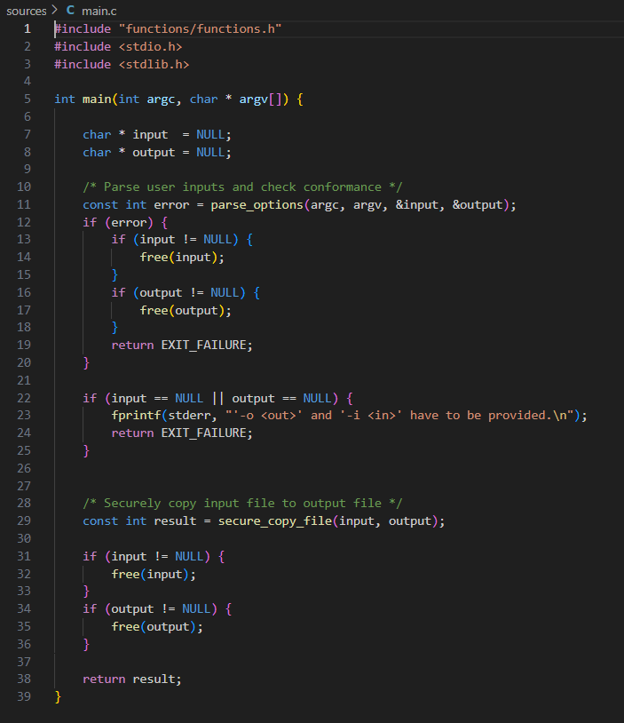
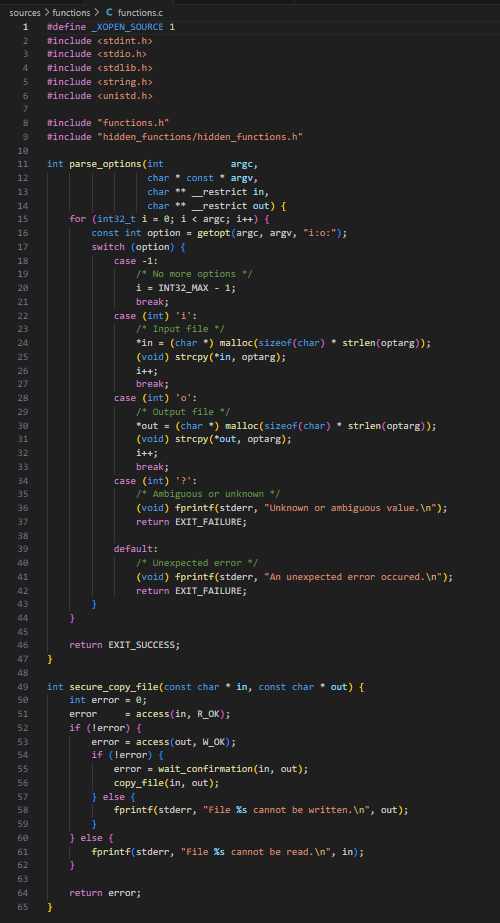
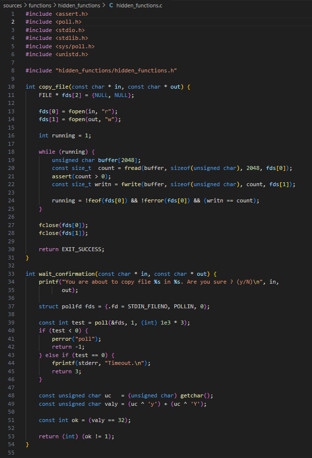
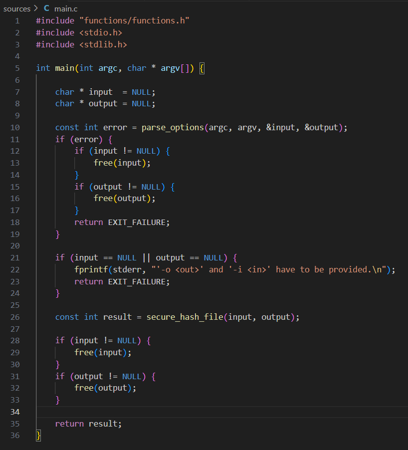
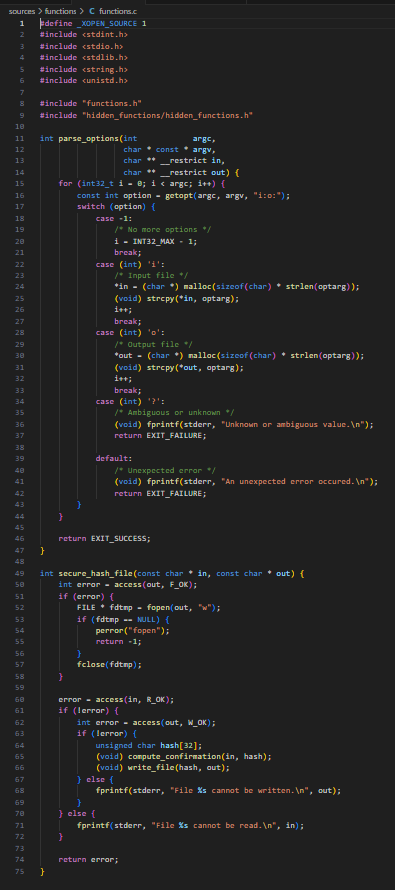
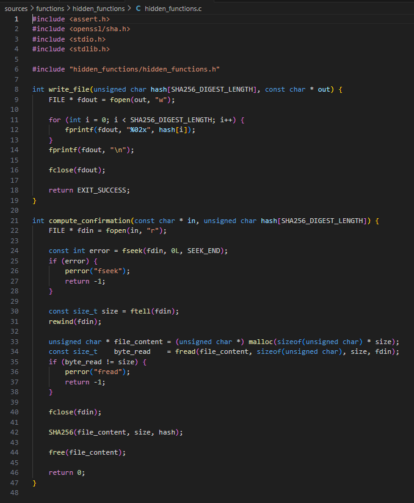

<!-- Remplacer 'en-GB' par 'fr' pour un document en français -->

<!-- 
	Markdown is a minimalistic HTML-based language
	
	The restricted set of functionalities is BY DESIGN,
	It is useful in any course context to restrict report formatting.
	You SHALL NOT try to circumvent how it works. You must CONFORM to the format. 
	Any text editor will work, since Markdown is just plain text.
	
	Visual Studio Code has nice basic support and previewing capabilities,
	and support several extensions that enhance the writing experience.
	You are stroongly advised to use them.

	The template is commented to guide you through the format,
	but you should *read* the comments to understand.

	Note that line breaks do not exist. You cannot skip a line, 
-->

<!-- Sections are denoted with a "#" at the very beginning of the line. Do not number the sections! Pandoc will handle that part -->
# Introduction

The present laboratory project explores the functionalities, vulnerabilities and mitigation techniques of the `project_v0` program, while also diving a bit into the general idea and security implementations of the `project_v1` program. The analysis was done by first looking at the source code provided to understand the general functioning of both programs. Then, some vulnerabilities for `project_v0` were found, like the ability to do symbolic linking and  the time-of-check to time-of-use threat. For the `project_v1` program there were some technical issues regarding the lack of packages and tools to successfully exploit it. Therefore, the source code was studied and vulnerabilities were detected. These are discussed as well as some constraints implemented compared to `project_v0`. The exploitation of the `project_v0` program was made through the command line and it is further described in this paper. Finally, we present some mitigation techniques that could be used to avoid the exploitation presented in this project.

<!-- Each new "#" denote a lower section level, "##": subsection; "###": subsubsection; and so on. -->
# Programs

Two programs are under analysis in this paper.

## Project_v0

This is a file copier program compiled with a main function, some helper functions and hidden functions. The main purpose of this program is to get two files from the user, from which it reads the contents of one and writes these into the other file. The execution of this program is denoted as:

```
./file_copier -i input_file.txt -o output_file.txt
```

The flags `-i` and `-o` are there to explicitly declare the input and output file of the user. The main.c (see Fig. 1), copies the contents of an input file to an output file in a secure manner, entailed by the `secure_copy_file()` function. It implements error handling and managing resources appropriately. It starts by parsing and validating the command line arguments via the `parse_options()` function, filling the pointers input and output with the respective file paths. If there are any parsing errors, the program frees any allocated memory for input or output before exiting with a failure status. If the inputs are validated, the program continues to the `secure_copy_file()` function to copy the contents of the input file to the output file. After copying, the program frees the allocated memory to avoid memory leaks and returns the result of the copying operation, which can either be a success or a failure. This is done ensuring errors are handled correctly.

{ width=60% }

On the other hand, the `functions.c` file is a secure file copy utility that is designed to take user input and output file paths, validate them, and "securely" copy the contents from the input file into the output file. It uses the function `parse_options()` to handle the command line arguments via the library `getopt()`, considering `-i` and `-o` flags to identify the input and output file paths, respectively. If valid files are detected, memory is allocated to store these file paths, and the values are copied using the `strcpy()` function. In case of any errors, such as ambiguous or unknown options, the program has error handling and exits with a failure status, hence providing secure failing in case of incorrect user input.

Furthermore, in this file we can find the `secure_copy_file()` function used in the `main.c`. The "secure" part comes from the fact that it implements some security checks while performing the copy. First, using the `access()` function, it checks whether the input file is readable and the output file is writable. If this is not the case for any of the files, an error handling case occurs and the program is terminated. If the files are validate, the function proceeds to call the `wait_confirmation()` hidden function to ask the user for confirmation before copying. The actual operation of copying is done by another hidden function which is called only if the user confirms the action. his layered approach ensures that file access permissions are checked, user intent is verified, and potential security risks, such as overwriting or reading critical files without consent are avoided (to some extent).

{ width=60% }

The last `.c` file contains the hidden functions of the program `copy_file()` and `wait_confirmation()`. `copy_file()` does the copying functionality previously described using the input and output files provided by the user, processing the data in chunks of 2048 bytes. The reading and writing on each file is done in read mode and write mode, respectively, closing them after usage. During the copying operation, the function checks for read or write errors and makes sure the data is successfully written into the output file, while also using assertion to handle unexpected behavior.

The `wait_confirmation()` is a crucial function for the exploit presented in this paper. It is a function that tries to enhance security by adding a confirmation step to the user's action. It performs this action by asking for the confirmation, with a timeout after 3 seconds, using `poll()` function to check whether standard input is available. If the user takes too long or enters anything other than 'y' or 'Y', the function will provide an error and abort its copy operation. This was intended to defend against accidentally copying the files and ensuring an affirmative choice by the user.

{ width=60% }

## Project_v1

For this program, this `main.c` file is used for "securely" hashing the contents of an input file and storing the result in the output file. It begins by declaring pointers for the input and output file paths, which are taken through the `parse_options()` function. This function, as explained, processes command line arguments and validates that both -`i` and `-o` options are provided; if not, or if an error occurs, the program frees up any allocated memory and exits with a failure status. If the files are validated the program behaves similarly to the one presented before, it calls the `secure_hash_file()` to "securely" hash the contents of the input file to then write it into the output file. Once the operation is complete, the program releases any dynamically allocated memory for the file paths and returns the result of the hashing operation.

{ width=60% }

The file depicted in Fig. 5 provides functionality for parsing command line arguments and securely hashing the contents of an input file into an output file. The function `parse_options()` processes the arguments provided by the user, ensuring that the input `-i` and output `-o` paths are provided. Both paths are dynamically allocated, with error checking to catch invalid or missing arguments. If there are no errors, the program will hash the input file using the `secure_hash_file()` function.

In the `secure_hash_file()` function, the first thing the program does is to ensure that the output file exists, creating an empty one if it does not. Then it checks if the input file has permissions to read and the output file has permissions to write into. If both files pass their respective permission checks, the program computes the hash for the input file by utilizing the `compute_confirmation()` function and writes said hash to the output file with `write_file()`. It implements comprehensive error handling, which reports on issues such as missing read or write permissions and ensures file operations are handled gracefully.

{ width=60% }

Lastly, on Fig. 6 we can see the contents of the `hidden_functions.c` file which help compute the SHA-256 hash of a file's content and save the hash value to an output file, in this case, provided by the user. The `compute_confirmation()` function handles the hash calculation by reading the entire content of the input file, using the `SHA256()` function from the OpenSSL library to compute the hash. This is done by opening the input file, determines its size using `fseek()` and `ftell()`, and reads the content into a dynamically allocated buffer. After computing the hash, it frees the allocated memory and closes the file. The second part of the C source code shows the `write_file()` function which is responsible for writing the computed hash to the specified output file in hexadecimal format. Here, each byte of the hash is printed as a two-digit hexadecimal value, and the result is followed by a newline character. At the end, the function ensures the output file is properly closed after writing to maintain the integrity of the operation.


{ width=60% }


# Analysis

## Project_v0: issues and exploitations

The vulnerability in the given code stems from improper handling of symbolic links during file operations, combined with a **race condition** introduced by the `wait_confirmation` function. Specifically, the program does not properly validate whether the input file is a symbolic link before performing the file copy operation, which allows to exploit the program by using symbolic links to redirect the input file to sensitive files on the system, such as `/etc/shadow`.

The `wait_confirmation` function is key to this vulnerability because it introduces a **3-second delay** to give the user a chance to confirm or reject the operation. During this waiting period, we can manipulate the input file by creating a symbolic link to a sensitive file before the program asks for user input. This allows to trick the program into copying the contents of a critical file, such as `/etc/shadow`, instead of the intended input file.

To demonstrate the exploitation of this vulnerability, a symbolic link was created using the `ln` command, linking a file named `test_in2.txt` to the sensitive `/etc/shadow` file on the system. The exploit was carried out on the university's server, where both the malicious `ln` command and the vulnerable `file_copier` program were executed in parallel using `tmux`. This setup allowed for precise timing, as the symbolic link had to be created before the 3-second timeout expired in the `wait_confirmation` function, which was responsible for the race condition. By linking the input file to `/etc/shadow` just before the timeout expired, the attacker could confirm the operation (by pressing "y") and successfully copy the contents of `/etc/shadow` to the output file.

The command used to exploit the vulnerability was:

`ln -s /etc/shadow test_in2.txt`

This command creates a symbolic link, test_in2.txt, pointing to the system's shadow file. The vulnerable file_copier program was then run with the following command:
`./file_copier -i test_in2.txt -o test_out.txt`

Since the input file `test_in2.txt` was a symbolic link, the program followed the link and tried to copy the contents of `/etc/shadow`, instead of `test_in2.txt`. The program did not validate the symbolic link, and the malicious redirection of the file copy operation succeeded.

The following screenshots illustrate the exploit:
{ width=60% }


## Project_v1: issues

After close analysis of the functionality of this program, while we were not able to exploit it we wanted to comment on its vulnerabilities. This is common in programs where there is improper handling of inputs, insufficient checks on memory and file operations, and potential flaws in the way resources are managed. Some of the vulnerabilities encountered are:

- The `parse_options()` to allocate the path names for the input and output files calculates the size without considering the extra byte for the null terminator, which may lead to a buffer overflow when `strcpy()` is used to copy the input strings. The program does not check or sanitize the file path from the user input at all, so it would be vulnerable to directory traversal attacks, symbolic link attack, or allow access to critical files.
- The `secure_hash_file()` function has several file access-related bugs. For example, there is a Time-of-Check-to-Time-of-Use (TOCTOU) bug after the access check that is supposed to ensure that the permissions of the file are handled properly. An attacker could switch the file out (e.g., through symbolic links) to point to a sensitive or unintended location during the gap between the check of access permissions and the actual opening or writing to the file. This can result in unauthorized overwriting of files, data corruption, or leakage of sensitive information. Additionally there are risks withing the functions `fopen()` in `secure_hash_file()`, `write_file()`, and `compute_confirmation()`, which lack error checking to verify the if the file modifications were successful. For example, if the file descriptor is NULL, the program's behavior may be undefined.
- The way `compute_confirmation()` handles the user files provided, it does not account for excessively big files, which could enable attacks like DoS or heap exhaustion. Also, there might be some pathways were memory is not freed, which could lead to memory leakage. 
- The lack of validation on the output file introduces the risk of symbolic links being exploited to redirect writes to files not intended for writing. This vulnerability is more risky by the TOCTOU vulnerabilities described earlier, in which access checks occur in a different step than actual file operations. This allows an advert to attack these gaps to overwrite systems or applications that use critical files.

# Solutions

TO DO: explain theories to solve the vulnerability

# Patched vulnerability

# Conclusions
<!-- You should skip a line before and after a bullet point. You can use whatever symbole you want, "-", "*" ... -->
Bullet point list:

- Item 0
- Item 1
- Item 2

<!-- Nesting lists depend on tabulation. Number are not important, only the first one determine where the list begin. However, it is good practice to use the actual numbewr -->
Numbered and nested list:

- from 0:

    0. Item 0
    1. Item 1
    2. Item 2

- from 1 (remarkable how the numbers are in fact ignored):

    1. Item 0
    1. Item 1
    2. Item 2

## Second section

### Code blocks

<!-- Never use screenshots, use code blocks ! They are more legible, syntaxically colored, and more portable. Again, skip lines before and after a block. -->
Let's show some C++ code:

```C++
class A {
private:
    int _a;
public:
    int a() const {return a;}
}
```

Or some python:

```python
class A:
    def __init__(self):
        self.__a = int(0)
    
    def a(self):
        return self.__a
```

Or even, let's inline some C code: `int inlined_C_code() {}`{.C}.
<!--  Warning: the inline code language specification (the `{.C}`) is a Pandoc extension. -->

### Links

<!-- if you don't know what an URL is, lookup "uniform resource locator (URL)" on Wikipedia -->
Markdown is like slimmer HTML, so [URL works](https://www.markdownguide.org/basic-syntax/).

### Images

Markdown use links, so you can link local files, but also print images like so (again, width specification is a Pandoc extension):

<!-- The link here is a relative path, so the file must exists somewhere --> 
{ width=60% }

<!-- You can safely delete the whole part up to the endi. It is just to demonstrate that Markdown can be used for HTML as well. --> 
```{=latex}
\begin{comment}
t makes no sense to reade the web in a PDF or in \LaTeX, thus the follwing is impossible.
Let's ignored that:

\begin{verbatim}
```

But it can also be on the web:

{external=1}

```{=latex}
\end{verbatim}
\end{comment}
```
